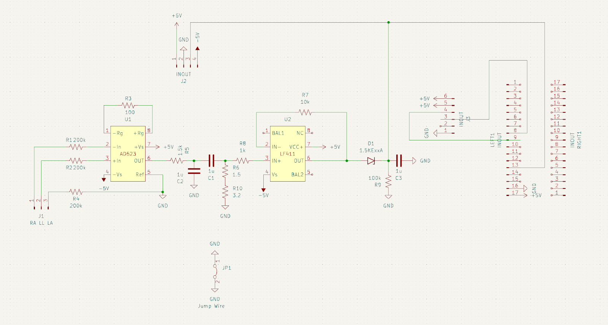
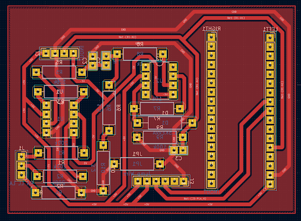

# EMG Project

## Summary

This project's purpose was to create a circuit to measure and amplify electromyography (EMG) signals, read them using a microcontroller, digitally filter the signal, and move a prosthetic hand when the user flexes their muscle. This is the third part in a series of EMG projects to get the prosthetic hand to reliably open and close when the user flexes. The first and second parts used a MyoWare muscle sensor to measure the muscle signals and used a fast Fourier transform (FFT) to filter out the desired frequencies that correspond only to the muscle flexing. This worked well in accurately filtering for the correct frequencies but it was not real-time since the FFT requires a certain number of samples and takes time to complete. The servo that was acting as the arm was also being driven directly from the microcontroller and the noise it generated turned the sensor readings into complete noise. This project looked to improve both of these drawbacks. This version uses a digital Chebyshev bandpass filter to isolate the desired frequencies. This can be done in real-time since the time required to apply the filter is significantly shorter than the sample time. The servo issue was fixed by using a PCA9685 servo driver to drive four servos in a prosthetic hand with a separate power supply.

## Materials used

- ESP32 PICO-D4 microcontroller
- Custom PCB
- Sainsmart Genmitsu 3018-PRO CNC Router Kit
- 3D printed prosthetic hand
- 4 MG995 servos

## How it was made

### Design and production of the PCB

First, we designed a circuit to filter and amplify muscle signals. This circuit was tested on a breadboard before making a PCB. The circuit consisted of an AD623 instrumentation amplifier with a gain of 200 V/V, a passive first-order bandpass filter with corners of 20 Hz and 110 Hz, an LF411 op-amp with a gain of 10 V/V, and an envelope detector. The image below shows the circuit diagram.

    

We then used KiCad to design a custom PCB to hold all of our EMG circuit components and the ESP32 that would sample and process the signal. The image below shows the PCB layout.

    

We imported the files from KiCad into FlatCam to generate the Gcode for the CNC router to print the PCB. We used the CNC router to print the PCB onto a copper plate. Once the PCB was populated, it was tested using conductivity tests to try to find any shorts and remove them. The circuit was then tested using an oscilloscope to make sure everything still worked.

### Creating the code

The Arduino IDE was used to program the ESP32. First, to get a consistent sampling period, a timer interrupt written for ESP32s was set up to sample at 10 ms. A sampling period of 2 ms was attempted at first, but the microcontroller we used was unable to properly apply the filter quickly enough. Next, using MATLAB, a digital bandpass Chebyshev filter was designed to be implemented in Arduino. The filter was applied inside of the interrupt service handler function and the filtered output was stored as a global double. In the loop function, an average of the last 50 data points was calculated and if the current sample value is over double the average, the prosthetic hand would actuate. 
