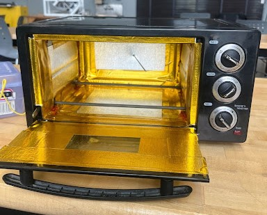
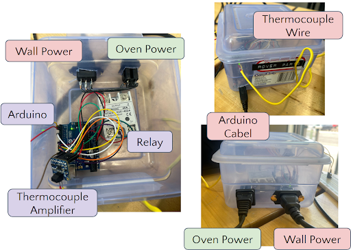
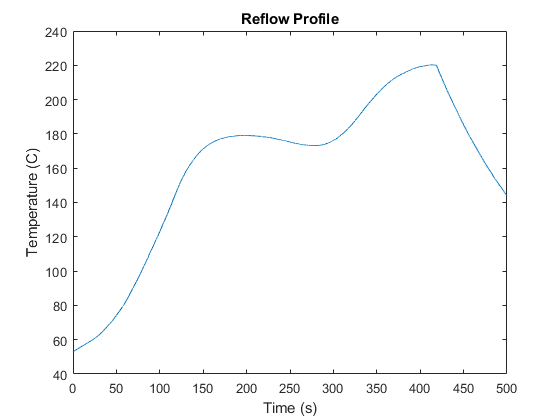

# Reflow Oven Project

## Summary

I worked with a teammate to create a solder reflow oven using a repurposed toaster oven and control it using a PID controller. A reflow oven is an oven that is designed to control its temperature in the proper way to melt solder paste and solder many surface mounted components to a PCB. Solder pastes have a designated heating curve specified by the manufacturer that the oven should follow for the best results. Generally, the best way to do this is to use a control system that is tuned to the specific oven. This project ended up being somewhat of a success because the control system did mostly work. However, the oven was too large to properly control the temperature because it took too long to heat up and even longer to cool down. This project was supposed to be the starting off point for a reflow oven at CMU designed and made by students so the plan was to have this project take place over the course of several semesters. This project properly figured out what works and what doesn't for making a control system and prepared the next students who take on this project to make a much better reflow oven.

## Materials Used

- Hamilton Beach Toaster Oven 31507R
- High-temperature RTV silicone
- Gold adhesive backed heat barrier tape
- Floor and tunnel shielding 050501
- Thermocouple type K 36GL06
- Adafruit universal thermocouple amplifier MAX31856
- TWTADE solid state relay SSR-40DA
- Arduino Uno
- 120 V wall power cable
- Wall socket inlet and outlet
- Small box

## Technical Details

The oven did not get hot enough fast enough to properly follow an example heating curve so we did our best to insulate it. The following picture shows the inside of the insulated oven.

    

This insulation did make it heat up faster and get to a higher temperature, but it was still too slow. The temperature was controlled by adjusting the voltage that the oven recieved. The oven plugged into the small box that held all of the components required to adjust the voltage, and the box plugged into the wall. Between the wall plug and the oven plug was a solid state relay to turn on and off the power to the oven. The relay was controlled by an Arduino which used 50 Hz PWM to control the voltage the oven recieved. The thermocouple amplifier was also housed in the box. The amplifier communicated with the Arduino using SPI. The thermocouple read the oven's temperature through a small hole in the back of the oven and then plugged into the amplifier through a hole in the control system box. The following graphic shows several angles of the control system box with labels on everything (ignore Arduino cable being misspelled (I didn't make the graphic)).

    

The code I wrote for this project used two PID controllers for two stages the oven would be in. First, it uses a controller to heat the oven up to 50 degrees Celcius with the door open and waits for the user to put the prepared PCB in. Once the PCB has ben placed in the oven, the user closed the door and presses a button to start the actual heating cycle. The controller used to follow the user deffined heating curve is different from the pre-heat controller because it is done with the door closed. Once the temperature reaches its peak, the user opens the door to allow the PCB to cool down quicker. To tune the first controller, I input a step function and observed the response. I adjusted the proportional gain until there were oscillations and then used the derivative gain to dampen them. I went back and forth adjusting the gains until I settled on gains I thought worked well. Setting the integral gain to anything greater than zero to remove steady-state error caused a dramatic overshoot overshoot, so I elected to ignore the integral gain. Since the oven was so well insulated, it lost heat much too slowly to tune the second controller in the same way. Each step response would have taken around an hour to reach steady state which made tuning not feasable in the time we had to complete the project. Instead, the second controller was tuned by lowering the proportional gain of the first controller and running the oven through a reflow cycle and observing how well it followed the curve. I then adjusted the proportional gain until it followed the curve as well as it could. The image below shows the oven following a heating curve after we finished tuning.

    

